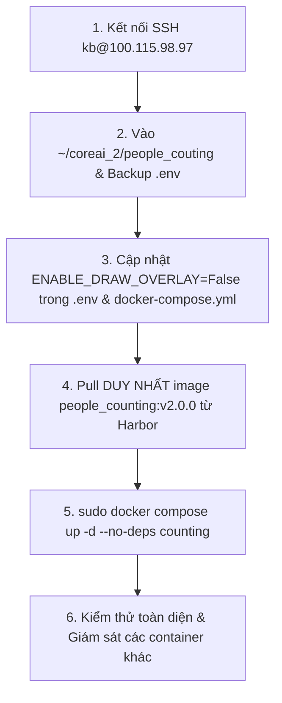
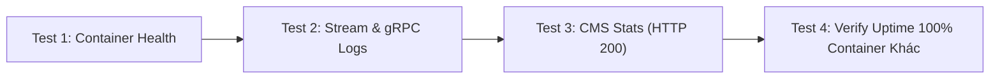

# Kế Hoạch Triển Khai: Cập Nhật Dịch Vụ Đếm Người Trên Server Từ Xa (Phương Án 2 - SSH Tự Động)

Tài liệu kế hoạch chi tiết quy trình tự động kết nối qua SSH tới server `kb@100.115.98.97`, pull images mới từ Harbor, cập nhật biến môi trường `ENABLE_DRAW_OVERLAY=False`, tái khởi động **DUY NHẤT** container đếm người tại thư mục `~/coreai_2/people_couting/`, và thực hiện quy trình kiểm thử độ ổn định thực tế mà **tuyệt đối không làm ảnh hưởng đến bất kỳ container hay dịch vụ AI nào khác trên máy chủ**.

---

## 1. Thông Tin Máy Chủ & Nguyên Tắc An Toàn Tối Cao

* **Địa chỉ IP máy chủ**: `100.115.98.97`
* **Tài khoản SSH**: `kb`
* **Mật khẩu SSH / Sudo**: `a`
* **Thư mục dự án**: `/home/kb/coreai_2/people_couting/`
* **Container mục tiêu**: `grpc-main-people-counting` (Image: `harbor.tado.vn/long_dev/people_counting:v2.0.0`)

### ⚠️ Ràng Buộc An Toàn Tuyệt Đối (Zero Impact On Other Services)
1. Máy chủ đang chạy đồng thời toàn bộ hệ thống lõi: `cms-api`, `cms-postgres`, `cms-redis`, `alarm-intrusion`, `alarm-crowd`, `alarm-fire`, `grpc-main-trafsec`, `face-engine`...
2. **NGHIÊM CẤM** chạy các lệnh toàn cục như `docker stop`, `docker restart`, hoặc `docker compose down`.
3. Khi tái khởi động, bắt buộc dùng cờ `--no-deps` và chỉ định đích danh service:
   ```bash
   echo a | sudo -S docker compose -f /home/kb/coreai_2/people_couting/docker-compose.yml up -d --no-deps counting
   ```
   *Cờ `--no-deps counting` đảm bảo Docker daemon chỉ tạo lại đúng 1 container đếm người, hoàn toàn không đụng đến detector hay bất kỳ container nào khác.*

---

## 2. Quy Trình Triển Khai Từng Bước (Phương Án 2)



### Bước 1: Kết nối SSH & Kiểm tra hiện trạng
* Thực thi lệnh SSH vào `kb@100.115.98.97`.
* Kiểm tra trạng thái hiện tại trong thư mục `/home/kb/coreai_2/people_couting/`.
* Ghi nhận danh sách container đang chạy và Uptime của toàn hệ thống bằng `docker ps` để đối chiếu sau khi nâng cấp.

### Bước 2: Sao lưu & Cập nhật cấu hình môi trường
1. Tạo bản sao lưu an toàn:
   ```bash
   cp /home/kb/coreai_2/people_couting/.env /home/kb/coreai_2/people_couting/.env.bak_$(date +%Y%m%d_%H%M%S)
   ```
2. Thêm cờ `ENABLE_DRAW_OVERLAY=False` vào `.env`:
   ```bash
   grep -q "ENABLE_DRAW_OVERLAY" .env && sed -i 's/^ENABLE_DRAW_OVERLAY=.*/ENABLE_DRAW_OVERLAY=False/' .env || echo "ENABLE_DRAW_OVERLAY=False" >> .env
   ```
3. Đảm bảo image tag trong `.env` trỏ đúng bản mới trên Harbor:
   ```bash
   sed -i 's|^IMAGE_NAME_COUNTING=.*|IMAGE_NAME_COUNTING=harbor.tado.vn/long_dev/people_counting:v2.0.0|' .env
   ```
4. Đảm bảo `docker-compose.yml` có truyền biến `ENABLE_DRAW_OVERLAY: ${ENABLE_DRAW_OVERLAY:-False}` vào service `counting`.

### Bước 3: Pull Image Mới Từ Harbor
Chỉ pull chính xác image của dịch vụ đếm người để tiết kiệm băng thông và không ảnh hưởng đến các service khác:
```bash
echo a | sudo -S docker pull harbor.tado.vn/long_dev/people_counting:v2.0.0
```

### Bước 4: Tái khởi động AN TOÀN Container Counting
Khởi động lại duy nhất service `counting`:
```bash
cd /home/kb/coreai_2/people_couting && echo a | sudo -S docker compose up -d --no-deps counting
```

---

## 3. Kế Hoạch Kiểm Thử Sau Khi Triển Khai (Verification & Testing Plan)

Sau khi container được tái khởi động, thực hiện 4 bước kiểm thử nghiêm ngặt trước khi hoàn tất:



### Test 1: Kiểm tra trạng thái Container Counting
* Lệnh: `echo a | sudo -S docker compose -f /home/kb/coreai_2/people_couting/docker-compose.yml ps`
* **Kỳ vọng**: Container `grpc-main-people-counting` ở trạng thái `Up` (healthy) với image `harbor.tado.vn/long_dev/people_counting:v2.0.0`.

### Test 2: Kiểm tra Nhật Ký Hoạt Động (Live Logs)
* Lệnh: `echo a | sudo -S docker logs --tail=60 grpc-main-people-counting`
* **Kỳ vọng**:
  * [x] Kết nối camera SDK / RTSP thành công (Dahua GPU / CPU connected).
  * [x] Kết nối gRPC tới detector thành công (`Connected to detector:50060`).
  * [x] Đồng bộ rules và vạch đếm từ CMS API thành công (`STATUS-GET-RULES: 200`).
  * [x] Khởi tạo `PersonProcessor` và `StatisticsPoster` bình thường, không có ngoại lệ.

### Test 3: Kiểm tra Gửi Thống Kê CMS (POST /api/camera-statistics)
* Theo dõi log trong 30 giây tiếp theo:
  `echo a | sudo -S docker logs -f --tail=30 grpc-main-people-counting`
* **Kỳ vọng**: Định kỳ mỗi chu kỳ 5 giây, xuất hiện log:
  `POST statistics for <stream_id> (people_counting): status=200 count=...`

### Test 4: Kiểm tra An Toàn Toàn Cục (Zero Impact Verification)
* Lệnh: `echo a | sudo -S docker ps --format "table {{.Names}}\t{{.Status}}"`
* **Kỳ vọng**:
  * DUY NHẤT container `grpc-main-people-counting` có thời gian tạo mới (`Up less than a minute`).
  * TẤT CẢ các container còn lại (`cms-api`, `cms-postgres`, `alarm-intrusion`, `alarm-crowd`, `alarm-fire`, `grpc-main-trafsec`...) vẫn giữ nguyên uptime ban đầu (Up 29 hours / 11 days / 13 days), hoàn toàn không bị gián đoạn hay khởi động lại.
