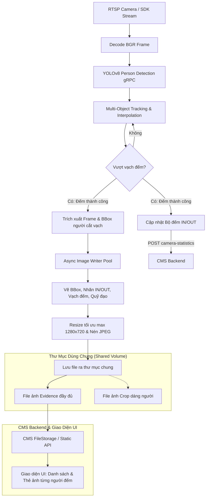

# Kế Hoạch Triển Khai: Lưu Ảnh Đếm Người Vào Thư Mục Chung Cho Backend & UI

Tài liệu thiết kế kiến trúc và kế hoạch triển khai chức năng **CORE AI tự động lưu ảnh bằng chứng mỗi khi đếm được 1 người vào THƯ MỤC DÙNG CHUNG (Shared Storage)** để Backend CMS đọc và hiển thị lên giao diện UI.

*(Lưu ý: Cơ chế alarm bên `long_dev` chỉ đóng vai trò tham khảo về logic vẽ ảnh/bằng chứng. Cơ chế thực thi chính ở đây là **lưu file ảnh trực tiếp vào volume/thư mục chung** giữa CORE AI và Backend).*

---

## 1. Phân Tích Cơ Chế Tích Hợp Qua Thư Mục Chung

### 1.1. Luồng phối hợp giữa CORE AI và Backend
1. **CORE AI (`PEOPLE_COUTING`)**:
   - Đọc RTSP camera, chạy model YOLOv8 detect người, tracking quỹ đạo.
   - Khi phát hiện một người **vượt qua vạch đếm (Line Crossing)** thành công:
     - Xác định hướng di chuyển (`IN` hoặc `OUT`), ID đối tượng, tọa độ BBox.
     - Lấy khung hình tại thời điểm cắt vạch, vẽ bằng chứng (vạch đếm, BBox người, hướng di chuyển, ID).
     - **Ghi file ảnh ra thư mục dùng chung (Shared Storage)** qua một luồng chạy nền (Async ThreadPool) để đảm bảo không làm tụt FPS của AI.
2. **Thư Mục Dùng Chung (Shared Directory / Docker Volume)**:
   - Được ánh xạ (mount volume) đồng thời vào cả container **CORE AI** (`grpc-main-people-counting`) và container **Backend CMS** (hoặc Web Server).
   - Ví dụ trên host: `/mnt/data/images/people_counting`
     - CORE AI mount vào: `/app/images` (biến `SAVE_IMAGE_DIR`)
     - Backend CMS mount vào: `/tmp/images/detect` (hoặc thư mục phục vụ static file của Backend).
3. **Backend CMS & Giao diện UI**:
   - Backend truy xuất trực tiếp ảnh từ thư mục chung này qua UUID hoặc theo đường dẫn tương đối để trả về cho Frontend UI hiển thị (thông qua API `GET /detected/{uuid}` hoặc static route).
   - UI hiển thị thẻ hình ảnh của từng người được đếm theo thời gian thực.

### 1.2. Nguyên tắc "Mỗi người đếm được = 1 ảnh tương ứng"
- Khác với lấn chiếm (gom nhiều xe trong 1 frame), bài toán đếm người yêu cầu:
  - **Mỗi lần có 1 người vượt vạch đếm thành công**: CORE AI tạo đúng **1 ảnh bằng chứng riêng biệt cho người đó**.
  - Tên file hoặc mã định danh (UUID / Track ID) gắn liền với lượt đếm của người đó, giúp Backend và UI ánh xạ chính xác người nào đi vào/ra lúc mấy giờ.

---

## 2. Kiến Trúc Hệ Thống & Luồng Dữ Liệu (Mermaid Diagram)



---

## 3. Quy Ước Cấu Trúc Thư Mục & Đặt Tên File Ảnh

Để đáp ứng tối đa tính tương thích với Backend CMS hiện tại, hệ thống sẽ hỗ trợ **2 chế độ lưu trữ** (cấu hình linh hoạt qua biến môi trường `IMAGE_STORAGE_MODE`):

### Chế độ 1: Chuẩn `TimeUUID` (Khớp 100% với `FileStorage` của Backend CMS)
CMS Backend hiện đang sử dụng `FileStorage` (được cấu hình trong `Desktop/cms/app/libs/storage.py` và `routes.py` qua endpoint `GET /detected/{uuid}`):
- Mỗi frame khi đọc từ `camera_reader.py` đã có sẵn mã `frame_uuid` (sinh bằng `uuid.uuid1()` - Time-based UUID).
- Cấu trúc thư mục được băm tự động theo chuẩn TimeUUID:
  ```
  {SAVE_IMAGE_DIR}/{node_id}/{YYYY-MM-DD}/{dir_1}/{dir_2}/{uuid}.jpg
  ```
- **Ưu điểm**: Backend CMS chỉ cần gọi `storage.get(uuid)` là tìm và đọc được ngay ảnh mà không cần sửa đổi logic tìm file của CMS.

### Chế độ 2: Chuẩn Phân Cấp Camera & Thời Gian (`hierarchy`)
Phù hợp cho việc duyệt file trực tiếp, phục vụ static file server Nginx/FastAPI:
```
{SAVE_IMAGE_DIR}/{stream_id}/{YYYY-MM-DD}/{timestamp}_{direction}_track_{track_id}.jpg
```
- Ví dụ:
  ```
  /app/images/64a8fa75-316d-49f3-8e19-dca09db78e19/2026-09-27/1722780005_IN_track_42.jpg
  /app/images/64a8fa75-316d-49f3-8e19-dca09db78e19/2026-09-27/crop_1722780005_IN_track_42.jpg
  ```
- **Ưu điểm**: Rất trực quan, quản trị viên xem thư mục biết ngay ảnh của camera nào, ngày nào, người thứ mấy, đi vào hay đi ra.

*(Có thể bật song song cả hai hoặc chọn mode qua biến môi trường).*

---

## 4. Thuật Toán Tạo Ảnh Bằng Chứng (Evidence Generation)

### 4.1. Quy trình xử lý hình ảnh
1. **Lấy dữ liệu tại khoảnh khắc cắt vạch**:
   - `frame`: Khung hình BGR gốc tại thời điểm người cắt qua vạch.
   - `obj`: Đối tượng tracking (`CountingTrackedPerson`) chứa BBox `(x, y, w, h)`, `id`, `conf`, `path_bottom`, `path_center`.
   - `direction`: Hướng di chuyển (`IN` hoặc `OUT`).
   - `line_points`: Tọa độ 2 điểm của vạch đếm.
   - `direction_vector`: Vector chỉ hướng (nếu có).
2. **Vẽ Overlay trực quan**:
   - **Vạch đếm**: Đường kẻ màu vàng nét dày (`thickness=2`).
   - **Vector hướng**: Mũi tên chỉ hướng đếm quy định.
   - **BBox người được đếm**:
     - Hướng `IN`: Bounding Box màu xanh lá `(0, 255, 0)`, `thickness=2`.
     - Hướng `OUT`: Bounding Box màu cam `(0, 165, 255)`, `thickness=2`.
   - **Nhãn thông tin (Badge Tag)**: Đặt phía trên đầu BBox:
     `Person #{id} [{IN/OUT}] ({conf*100:.0f}%)`
   - **Quỹ đạo di chuyển**: Vẽ các điểm nối của chân người (`path_bottom`) thể hiện quá trình bước xuyên qua vạch.
3. **Ảnh Crop cận cảnh (Optional)**:
   - Cắt riêng vùng BBox người với một khoảng viền nhỏ (padding 10%) để xem cận cảnh trang phục/khuôn mặt.
4. **Nén và Lưu File**:
   - Scale ảnh evidence về tối đa `1280x720` (nếu frame gốc 2K/4K) để tiết kiệm dung lượng đĩa.
   - Encode và ghi file JPEG với chất lượng cấu hình (mặc định `75 - 80`).

---

## 5. Tối Ưu Hiệu Năng: Ghi Đĩa Bất Đồng Bộ (Zero Block AI)

Việc ghi file ảnh độ phân giải cao ra ổ đĩa tốn từ `10ms - 50ms` tùy loại ổ cứng (HDD/SSD). Nếu thực hiện tuần tự trong luồng xử lý frame, FPS sẽ bị tụt nghiêm trọng.

**Giải pháp**:
- Sử dụng `ThreadPoolExecutor` chuyên biệt cho việc lưu ảnh (`image_writer_pool = ThreadPoolExecutor(max_workers=2)`).
- Tại thời điểm phát hiện vượt vạch:
  - Copy nhanh frame (`frame.copy()`) và các tham số đối tượng.
  - Submit tác vụ sang `image_writer_pool`.
  - Luồng AI chính lập tức tiếp tục xử lý frame tiếp theo mà không phải chờ ghi đĩa.
- Giới hạn kích thước hàng đợi chờ ghi để bảo vệ RAM nếu ổ đĩa bị nghẽn I/O tạm thời.

---

## 6. Chính Sách Quản Lý Bộ Nhớ Đĩa (Disk Retention & Auto-Cleanup)

Để tránh trường hợp camera đếm hàng nghìn người mỗi ngày gây đầy ổ cứng máy chủ:
1. **Cấu hình thời gian lưu trữ**: Biến `IMAGE_RETENTION_DAYS` (mặc định: `30` ngày).
2. **Luồng Cleanup định kỳ**:
   - Mỗi ngày một lần, background thread quét các thư mục ngày (`YYYY-MM-DD`).
   - Xóa các thư mục cũ hơn số ngày cấu hình.

---

## 7. Cấu Hình Docker Compose & Volume Mount Thư Mục Chung

Để Backend CMS và CORE AI cùng truy cập chung một thư mục trên máy host:

### 7.1. Cấu hình trên Host (`/mnt/data/images/people_counting`)
```bash
sudo mkdir -p /mnt/data/images/people_counting
sudo chmod -R 777 /mnt/data/images/people_counting
```

### 7.2. Cấu hình trong `PEOPLE_COUTING/docker-compose.yml`
```yaml
services:
  counting:
    # ...
    volumes:
      - ${SHARED_IMAGE_DIR:-/mnt/data/images/people_counting}:/app/images
      - ${LOG_DIR:-/mnt/logs/people_counting}:/logs
    environment:
      SAVE_IMAGE_DIR: /app/images
      IMAGE_STORAGE_MODE: ${IMAGE_STORAGE_MODE:-both}  # uuid | hierarchy | both
      SAVE_PERSON_CROP: ${SAVE_PERSON_CROP:-true}
      JPEG_QUALITY: ${JPEG_QUALITY:-75}
      IMAGE_RETENTION_DAYS: ${IMAGE_RETENTION_DAYS:-30}
```

### 7.3. Cấu hình phía Backend CMS
Container Backend CMS mount cùng thư mục máy host:
```yaml
services:
  backend-cms:
    volumes:
      - ${SHARED_IMAGE_DIR:-/mnt/data/images/people_counting}:/tmp/images/detect
```

---

## 8. Danh Sách Các File Cần Chỉnh Sửa Trong Mã Nguồn

| File | Nội dung chỉnh sửa |
| :--- | :--- |
| `counting/app/core/settings.py` | Bổ sung các cấu hình: `SAVE_IMAGE_DIR`, `IMAGE_STORAGE_MODE`, `SAVE_PERSON_CROP`, `JPEG_QUALITY`, `MAX_IMAGE_WIDTH`, `MAX_IMAGE_HEIGHT`, `IMAGE_RETENTION_DAYS`. |
| `counting/app/utils/helper.py` | Cập nhật/bổ sung hàm vẽ ảnh bằng chứng `draw_person_counting_evidence`, hàm lưu ảnh đếm người `save_counted_person_images` hỗ trợ cả TimeUUID và cấu trúc thư mục trực quan. |
| `counting/app/services/person_process.py` | Tích hợp `image_writer_pool`. Tại hàm `_check_line_crossing`, khi đếm thành công thì trigger tác vụ ghi ảnh nền ra thư mục chung. |
| `counting/docker-compose.yml` & `docker-compose.yml` | Thêm volume mount thư mục chung `/app/images` ánh xạ ra host. |
| `.env.example` & `.env` | Thêm biến môi trường `SHARED_IMAGE_DIR`, `IMAGE_STORAGE_MODE`, `SAVE_PERSON_CROP`, `JPEG_QUALITY`... |

---

## 9. Kế Hoạch Triển Khai Chi Tiết (Action Plan)

| Bước | Nội dung công việc | File tác động | Mục tiêu đạt được |
| :---: | :--- | :--- | :--- |
| **Bước 1** | Bổ sung các biến cấu hình lưu ảnh vào `settings.py` và `.env.example` | `core/settings.py`, `.env.example`, `.env` | Tham số linh hoạt (thư mục, chất lượng, crop, retention) |
| **Bước 2** | Viết module xử lý & lưu ảnh bằng chứng trong `helper.py` | `utils/helper.py` | Hàm vẽ vạch cắt, BBox, nhãn IN/OUT, lưu bất đồng bộ |
| **Bước 3** | Tích hợp ThreadPool ghi đĩa và kích hoạt lưu ảnh tại `_check_line_crossing` | `services/person_process.py` | Mỗi người đếm được tự động lưu đúng 1 ảnh tương ứng, non-blocking |
| **Bước 4** | Thêm tác vụ nền dọn dẹp ảnh cũ định kỳ | `services/person_process.py` / `engine.py` | Tự động xóa ảnh sau N ngày, chống đầy đĩa |
| **Bước 5** | Cập nhật Docker Compose file (volume mount thư mục chung ra host) | `counting/docker-compose.yml`, `docker-compose.yml` | Ánh xạ thư mục ảnh bền vững giữa host, CORE AI và Backend |
| **Bước 6** | **Rebuild Docker Image & Chạy lại Container** | Docker Build & Run | Container chạy bản build mới nhất với đầy đủ tính năng |
| **Bước 7** | **Kiểm thử toàn diện & Theo dõi độ ổn định (Chạy ổn định mới ngưng)** | Toàn hệ thống | Nghiệm thu toàn diện từ I/O, FPS, chất lượng ảnh đến tải hệ thống |

---

## 10. Quy Trình Rebuild & Khởi Chạy Lại Docker Containers

1. **Chuẩn bị thư mục chung trên máy Host**:
   ```bash
   sudo mkdir -p /mnt/data/images/people_counting
   sudo chmod -R 777 /mnt/data/images/people_counting
   ```
2. **Rebuild Docker Image cho service Counting**:
   - Sử dụng lệnh build non-cache để nạp toàn bộ mã nguồn cập nhật:
     ```bash
     cd /home/tado/Long-Ana/PEOPLE_COUTING
     docker compose build --no-cache counting
     ```
3. **Khởi động lại toàn bộ Containers**:
   ```bash
   docker compose down counting
   docker compose up -d counting
   # Hoặc restart toàn bộ hệ thống (detector + counting):
   # docker compose up -d --build
   ```
4. **Kiểm tra trạng thái Container**:
   - Xác nhận container chuyển sang trạng thái `Up` (healthy, không bị crash-loop):
     ```bash
     docker compose ps
     ```

---

## 11. Quy Trình Kiểm Thử Toàn Diện & Tiêu Chí Nghiệm Thu (Chạy Ổn Định Mới Ngưng)

Quá trình kiểm thử bắt buộc phải trải qua đầy đủ các bài test sau đây và duy trì trạng thái ổn định mới được coi là hoàn thành:

### 11.1. Test Khởi Động & Kết Nối (Service Healthcheck)
- [ ] Container `grpc-main-people-counting` khởi động thành công, không phát sinh ImportError hoặc SyntaxError.
- [ ] Kết nối gRPC thông suốt tới Person Detector (`grpc_person_detector` port 50060).
- [ ] Kết nối HTTP thông suốt tới CMS Backend API (`BASE_URL_API` port 8080) và xác thực `SESSION_KEY` hợp lệ.
- [ ] Đọc thành công danh sách Camera và cấu hình vạch đếm (`line_config`, `direction_config`) từ CMS.

### 11.2. Test Nhận Diện & Đếm Người (Line Crossing & Tracking)
- [ ] Đọc stream RTSP camera mượt mà, bộ giải mã (decode) hoạt động ổn định.
- [ ] YOLOv8 phát hiện người chính xác, module tracking duy trì bám vết quỹ đạo liên tục.
- [ ] Khi có người bước cắt qua vạch: bộ đếm ghi nhận đúng hướng (`IN` hoặc `OUT`), tăng số đếm tức thì mà không bị đếm trùng lặp (1 người = 1 lần đếm duy nhất).

### 11.3. Test Lưu Ảnh Vào Thư Mục Dùng Chung (Shared Storage Verification)
- [ ] Kiểm tra ngay tại thư mục chung `/mnt/data/images/people_counting/` (hoặc cấu hình) xuất hiện file ảnh tương ứng khi có người vượt vạch.
- [ ] **Chất lượng ảnh Evidence**:
  - Có vạch đếm màu vàng nét rõ.
  - Có Bounding Box bao quanh đúng người vừa cắt vạch (xanh lá nếu IN, cam nếu OUT).
  - Có nhãn hiển thị: `Person #ID [IN/OUT] (Độ tin cậy)`.
  - Có vết quỹ đạo di chuyển (path trail) thể hiện rõ hướng bước qua vạch.
  - Dung lượng file tối ưu (khoảng `80KB - 160KB`), độ phân giải chuẩn max 1280x720.
- [ ] **Ảnh Crop (nếu bật `SAVE_PERSON_CROP=true`)**: Cắt cận cảnh chuẩn xác vùng người với viền lề hợp lý.
- [ ] **Quyền truy cập file**: File ảnh được gán quyền đọc phù hợp (`chmod 666 / 777`) để container Backend CMS có thể đọc được ngay mà không gặp lỗi `Permission Denied`.

### 11.4. Test Tương Thích Backend CMS Đọc Ảnh
- [ ] Kiểm tra file được lưu theo đúng định dạng cấu hình:
  - Nếu chế độ `uuid`: Kiểm tra cấu trúc phân cấp băm TimeUUID khớp với hàm `storage.get(uuid)` của CMS Backend (`GET /detected/{uuid}`).
  - Nếu chế độ `hierarchy`: Kiểm tra đường dẫn `{camera_id}/{YYYY-MM-DD}/...` khớp với đường dẫn cấu hình phục vụ static file của Backend.

### 11.5. Giám Sát Hiệu Năng & Độ Ổn Định Dài Hạn (Stress & Stability Testing)
- [ ] **Độ mượt FPS**: Giám sát log xem FPS đọc/xử lý camera có bị drop khi ghi ảnh liên tục hay không (phải duy trì ổn định tốc độ cấu hình 10 - 25 FPS nhờ luồng ThreadPool nền).
- [ ] **Kiểm tra tài nguyên (Resource Leak Check)**:
  - Chạy lệnh `docker stats grpc-main-people-counting` theo dõi trong thời gian chạy liên tục:
    - Mức sử dụng CPU ổn định.
    - Mức sử dụng RAM không bị tăng lũy tiến (không rò rỉ bộ nhớ / memory leak).
    - Mức sử dụng VRAM GPU ổn định.
- [ ] **Không còn Exception**: Theo dõi `docker logs -f grpc-main-people-counting` trong suốt quá trình chạy thực tế, xác nhận không xuất hiện bất kỳ unhandled exception, crash thread hoặc timeout nào.

**Chỉ khi toàn bộ 5 nhóm tiêu chí kiểm thử trên đều ĐẠT và hệ thống vận hành liên tục ổn định, việc nghiệm thu mới được coi là hoàn tất.**
