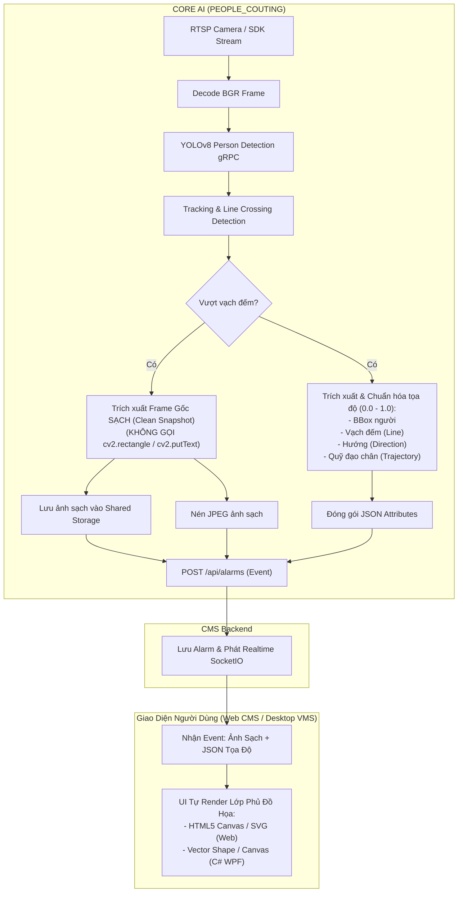
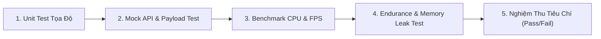

# Kế Hoạch Triển Khai: Chuyển Giao Trách Nhiệm Vẽ Box & Overlay Từ AI Core Sang UI

Tài liệu thiết kế kiến trúc và kế hoạch triển khai việc **loại bỏ hoàn toàn tác vụ vẽ Bounding Box, Vạch đếm, Mũi tên và Quỹ đạo trong AI Core**, thay vào đó **gửi dữ liệu tọa độ chuẩn hóa (JSON Coordinate Schema) kèm ảnh sạch về CMS Backend để Frontend UI tự render động**.

---

## 1. Lý Do & Lợi Ích Của Việc Thay Đổi

### 1.1. Vấn đề của cơ chế hiện tại (AI Core tự vẽ)
* **Tốn tài nguyên CPU**: Mỗi khi có người vượt vạch, AI Core phải:
  * Clone frame ảnh (`frame.copy()`).
  * Thực hiện hàng loạt thao tác rasterization: `cv2.line`, `cv2.circle`, `cv2.arrowedLine`, `cv2.rectangle`, và `cv2.putText` (tính toán font bitmap, anti-aliasing).
  * Nén lại ảnh JPEG đã bị vẽ đè lên.
* **Ảnh gốc bị phá vỡ (Destructive Overlay)**: Lớp vẽ đè (baking) che mất thông tin khuôn mặt, chi tiết quần áo, biển số hoặc các đối tượng xung quanh trong bức ảnh gốc. Người dùng trên UI không thể tắt/bật lớp vẽ này khi cần quan sát chi tiết.
* **Không đáp ứng đa độ phân giải (Non-Responsive)**: Nét vẽ và kích thước chữ bị cố định theo pixel của ảnh; khi hiển thị trên các màn hình có tỉ lệ khác nhau (điện thoại, tablet, màn hình giám sát 4K) dễ bị vỡ hạt hoặc quá nhỏ/quá to.

### 1.2. Lợi ích khi UI tự vẽ dựa trên tọa độ
* **Tối ưu hóa tối đa hiệu năng AI Core**: CPU máy chủ AI không phải tốn chu kỳ tính toán cho việc render đồ họa, dành 100% tài nguyên cho giải mã video (NVDEC/CPU) và pipeline bám vết.
* **Giữ nguyên ảnh gốc chất lượng cao**: Ảnh lưu trữ và ảnh gửi lên CMS là ảnh sạch (Clean Raw Snapshot).
* **UI tương tác linh hoạt**: Phía UI (Web Canvas/SVG hoặc Desktop C# WPF/GDI+) có thể:
  * Bật / tắt hiển thị BBox, vạch kẻ, quỹ đạo tùy ý người dùng.
  * Tùy biến màu sắc, độ dày đường kẻ, kích thước nhãn thẻ theo theme giao diện.
  * Phóng to / thu nhỏ (zoom in/out) ảnh mà đường viền BBox vẫn sắc nét mượt mà dạng vector.

---

## 2. Kiến Trúc Luồng Dữ Liệu Mới (Mermaid Diagram)



---

## 3. Đặc Tả Chuẩn Tọa Độ (Standard Coordinate Contract)

Tất cả tọa độ được chuẩn hóa về dải số thực **`0.0 đến 1.0`** tương đối theo chiều rộng ($W$) và chiều cao ($H$) của khung hình.
* Công thức chuyển đổi từ pixel sang chuẩn hóa:
  $$x_{norm} = \frac{x_{pixel}}{W}, \quad y_{norm} = \frac{y_{pixel}}{H}$$

### 3.1. Cấu trúc Payload gửi lên CMS (`POST /api/alarms`)

```json
{
  "stream_id": "64a8fa75-316d-49f3-8e19-dca09db78e19",
  "type": "people_counting",
  "source": "64a8fa75-316d-49f3-8e19-dca09db78e19",
  "time": 1774584288.123,
  "image_base64": "<CLEAN_IMAGE_JPEG_BASE64>",
  "attributes": {
    "name": "person",
    "class_name": "person",
    "track_id": 42,
    "action": "enter",
    "direction": "in",
    "conf": 0.92,
    "frame_id": "9a9e21b4-1dbd-4457-a6ff-f7b29779383f",
    "camera_name": "Cổng Chính Tầng 1",
    "image_width": 1920,
    "image_height": 1080,
    "coordinates": {
      "bbox": [0.4215, 0.352, 0.512, 0.785],
      "counting_line": [
        [0.100, 0.500],
        [0.900, 0.500]
      ],
      "direction_vector": [0.0, 0.25],
      "trajectory": [
        [0.455, 0.380],
        [0.460, 0.420],
        [0.463, 0.465],
        [0.467, 0.515],
        [0.470, 0.560]
      ]
    }
  }
}
```

### 3.2. Giải thích chi tiết các trường tọa độ trong `coordinates`:

| Trường | Kiểu dữ liệu | Mô tả |
| :--- | :--- | :--- |
| `bbox` | `[x1, y1, x2, y2]` | Tọa độ góc trên-trái và góc dưới-phải của hộp người được đếm (tỉ lệ 0.0 - 1.0). |
| `counting_line` | `[[x1, y1], [x2, y2]]` | Tọa độ 2 đầu mút của vạch ảo đếm người. |
| `direction_vector`| `[vx, vy]` | Vector chỉ hướng quy định (tương ứng với chiều `IN`). |
| `trajectory` | `[[x, y], ...]` | Danh sách các điểm tiếp xúc đáy (chân người) theo thời gian, thể hiện quá trình bước qua vạch. |
| `image_width`, `image_height` | `int` | Kích thước gốc của bức ảnh, giúp UI tính toán tỉ lệ aspect ratio khi cần. |

---

## 4. Kế Hoạch Chỉnh Sửa Trong Mã Nguồn AI Core (`PEOPLE_COUTING`)

### 4.1. File `counting/app/core/settings.py`
* Thêm biến cờ cấu hình:
  ```python
  # Bật/tắt việc AI Core tự vẽ overlay lên ảnh (mặc định False để UI tự vẽ)
  ENABLE_DRAW_OVERLAY = _flag("ENABLE_DRAW_OVERLAY", "False")
  ```
* Cho phép người dùng bật lại nếu chạy với hệ thống CMS cũ chưa hỗ trợ UI rendering.

### 4.2. File `counting/app/utils/helper.py`
1. **Hàm `draw_person_counting_evidence`**:
   * Kiểm tra `if not getattr(settings, 'ENABLE_DRAW_OVERLAY', False): return frame.copy()`.
   * Bỏ qua toàn bộ các thao tác `cv2.rectangle`, `cv2.putText`, `cv2.line`, `cv2.arrowedLine`.
   * Chỉ giữ lại thao tác nén/resize ảnh sạch nếu kích thước vượt quá giới hạn cấu hình (`MAX_IMAGE_WIDTH`, `MAX_IMAGE_HEIGHT`).
2. **Hàm `save_counted_person_images`**:
   * Lưu ảnh gốc sạch ra Shared Storage (`images/...`).
   * Chuẩn hóa danh sách các điểm quỹ đạo `obj.path_bottom` thành danh sách tọa độ `0.0 - 1.0`:
     ```python
     norm_trajectory = [
         [round(p[0] / frame_w, 4), round(p[1] / frame_h, 4)]
         for p in getattr(obj, 'path_bottom', []) if p is not None
     ]
     ```
   * Chuẩn hóa tọa độ `line_points` và `direction_vector` thành tỉ lệ `0.0 - 1.0`.
   * Truyền toàn bộ tập tọa độ đã chuẩn hóa vào `send_person_counting_event`.

### 4.3. File `counting/app/api_clients/api_clients.py`
* Cập nhật hàm `send_person_counting_event`:
  * Nhận thêm các tham số: `line_points`, `direction_vector`, `trajectory`, `img_w`, `img_h`.
  * Đóng gói cấu trúc `coordinates` vào `attributes` của `create_alarm`.
  * Gửi ảnh sạch qua `frame` hoặc `image_base64`.

### 4.4. File `counting/app/services/person_process.py`
* Khi gọi `save_counted_person_images` trong hàm `_check_line_crossing`:
  * Truyền trực tiếp danh sách tọa độ sạch `obj.path_bottom`, `self._line_points`, `self._direction_vector` sang background worker.

---

## 5. Hướng Dẫn Code Mẫu Cho Đội Ngũ UI Frontend

### 5.1. Dành cho Web Frontend (HTML5 Canvas & JavaScript)
Khi nhận được dữ liệu sự kiện từ CMS API hoặc SocketIO:

```javascript
function renderPersonCountingOverlay(canvas, imageElement, eventData) {
    const ctx = canvas.getContext('2d');
    const w = canvas.width;
    const h = canvas.height;

    // 1. Vẽ ảnh sạch làm background
    ctx.drawImage(imageElement, 0, 0, w, h);

    const coords = eventData.attributes.coordinates;
    const action = eventData.attributes.action; // "enter" hoặc "exit"
    const isEnter = (action === "enter" || eventData.attributes.direction === "in");

    // 2. Vẽ Vạch đếm (Counting Line) màu vàng
    if (coords.counting_line && coords.counting_line.length >= 2) {
        ctx.strokeStyle = '#FFFF00';
        ctx.lineWidth = 3;
        ctx.beginPath();
        ctx.moveTo(coords.counting_line[0][0] * w, coords.counting_line[0][1] * h);
        ctx.lineTo(coords.counting_line[1][0] * w, coords.counting_line[1][1] * h);
        ctx.stroke();
    }

    // 3. Vẽ Quỹ đạo di chuyển (Trajectory)
    if (coords.trajectory && coords.trajectory.length > 1) {
        ctx.strokeStyle = '#00E5FF';
        ctx.lineWidth = 2;
        ctx.beginPath();
        coords.trajectory.forEach((pt, idx) => {
            const px = pt[0] * w;
            const py = pt[1] * h;
            if (idx === 0) ctx.moveTo(px, py);
            else ctx.lineTo(px, py);
        });
        ctx.stroke();
    }

    // 4. Vẽ Bounding Box người
    if (coords.bbox) {
        const [x1, y1, x2, y2] = coords.bbox;
        const bx = x1 * w, by = y1 * h;
        const bw = (x2 - x1) * w, bh = (y2 - y1) * h;
        const color = isEnter ? '#00FF00' : '#FF9900'; // Xanh lá = Vào, Cam = Ra

        ctx.strokeStyle = color;
        ctx.lineWidth = 2;
        ctx.strokeRect(bx, by, bw, bh);

        // 5. Vẽ Badge Tag thông tin
        const label = `Person #${eventData.attributes.track_id} [${isEnter ? 'IN' : 'OUT'}]`;
        ctx.font = 'bold 12px Inter, Arial, sans-serif';
        const textWidth = ctx.measureText(label).width;

        ctx.fillStyle = color;
        ctx.fillRect(bx, Math.max(0, by - 20), textWidth + 10, 20);

        ctx.fillStyle = '#000000';
        ctx.fillText(label, bx + 5, Math.max(14, by - 5));
    }
}
```

### 5.2. Dành cho Desktop C# Client (Kabe VMS / WPF)
```csharp
// Chuyển đổi tọa độ chuẩn hóa sang tọa độ Viewport hiển thị
float viewWidth = (float)imageControl.ActualWidth;
float viewHeight = (float)imageControl.ActualHeight;

// Vẽ Bounding Box
var bbox = eventData.Attributes.Coordinates.Bbox;
var rect = new Rect(
    bbox[0] * viewWidth,
    bbox[1] * viewHeight,
    (bbox[2] - bbox[0]) * viewWidth,
    (bbox[3] - bbox[1]) * viewHeight
);
drawingContext.DrawRectangle(null, new Pen(isEnter ? Brushes.LimeGreen : Brushes.Orange, 2), rect);
```

---

## 6. Lộ Trình Triển Khai (Checklist Từng Bước)

| Bước | Nội dung công việc | File tác động | Đánh giá |
| :---: | :--- | :--- | :--- |
| **Bước 1** | Thêm cấu hình cờ `ENABLE_DRAW_OVERLAY` vào settings | `counting/app/core/settings.py`, `.env.example`, `.env` | Mặc định `False` để tắt việc vẽ |
| **Bước 2** | Nâng cấp hàm chuẩn hóa tọa độ (BBox, Line, Trajectory, Vector) | `counting/app/utils/helper.py` | Chuẩn hóa toàn bộ về dải `0.0 - 1.0` |
| **Bước 3** | Cập nhật logic lưu ảnh (chỉ lưu ảnh gốc sạch khi `ENABLE_DRAW_OVERLAY=False`) | `counting/app/utils/helper.py` | Tiết kiệm CPU, không gọi OpenCV drawing |
| **Bước 4** | Mở rộng cấu trúc payload `POST /api/alarms` chứa `coordinates` | `counting/app/api_clients/api_clients.py` | Đảm bảo tương thích ngược và giàu dữ liệu |
| **Bước 5** | Kiểm thử luồng gửi dữ liệu và log kiểm tra tọa độ | Test nội bộ pipeline | Xác nhận không còn hao tổn CPU cho `cv2.putText/rectangle` |
| **Bước 6** | Thực hiện bài test độ ổn định (Stress/Endurance Test) | Giám sát CPU/RAM/FPS | Đạt toàn bộ Tiêu chí Nghiệm thu (Mục 7) mới dừng |

---

## 7. Kế Hoạch Kiểm Thử Chương Trình & Đánh Giá Độ Ổn Định (Testing & Stability Verification)

Để đảm bảo hệ thống hoạt động chính xác, ổn định tuyệt đối và không phát sinh lỗi tiềm ẩn trước khi kết thúc công việc, quy trình kiểm thử sẽ được tiến hành qua 5 giai đoạn:



### 7.1. Giai đoạn 1: Kiểm thử đơn vị & Tính toàn vẹn của tọa độ (Unit & Contract Test)
* **Mục tiêu**: Đảm bảo tất cả các điểm tọa độ đều nằm nghiêm ngặt trong khoảng $[0.0, 1.0]$.
* **Nội dung thực hiện**:
  * Viết script test độc lập kiểm tra qua các ca kiểm thử:
    1. **BBox nằm trong frame**: $[x_1, y_1, x_2, y_2] \in [0.0, 1.0]$.
    2. **BBox tràn viền**: Tọa độ âm hoặc lớn hơn kích thước frame được clamp (cắt tỉa) an toàn về khoảng $[0.0, 1.0]$.
    3. **Quỹ đạo (Trajectory) nhiều điểm**: Danh sách điểm $[[x, y], ...]$ được làm tròn 4 chữ số thập phân, không chứa giá trị `None` hoặc `NaN`.
    4. **Vạch cắt & Vector hướng**: Chuẩn hóa chính xác theo $W$ và $H$.

### 7.2. Giai đoạn 2: Kiểm thử Payload và Giao tiếp CMS (`POST /api/alarms`)
* **Mục tiêu**: Kiểm tra dữ liệu gửi đi không làm vỡ schema của CMS Backend hiện tại (Backward Compatibility).
* **Nội dung thực hiện**:
  * Kiểm tra cấu trúc payload khi kích hoạt sự kiện đếm người:
    * Payload chứa đầy đủ `stream_id`, `type="people_counting"`, `attributes`.
    * Trong `attributes` có đủ `coordinates` (`bbox`, `counting_line`, `trajectory`, `direction_vector`).
    * Chuỗi `image_base64` là ảnh JPEG hợp lệ, có thể decode lại thành ảnh BGR sạch (không dính nét vẽ đè).

### 7.3. Giai đoạn 3: Đo lường Hiệu Năng & Tiết Kiệm Tài Nguyên (CPU & FPS Benchmark)
* **Mục tiêu**: Chứng minh việc tắt vẽ đồ họa giúp giảm tải CPU rõ rệt cho máy chủ AI.
* **Chỉ số đo lường**:
  | Chỉ số kiểm tra | Trạng thái cũ (`ENABLE_DRAW_OVERLAY=True`) | Trạng thái mới (`ENABLE_DRAW_OVERLAY=False`) | Kỳ vọng đạt được |
  | :--- | :---: | :---: | :--- |
  | **CPU Usage của luồng Worker** | ~15% - 25% mỗi camera lúc đông người | Thấp hơn đáng kể | **Giảm ít nhất 30% - 50% CPU** tại khâu xuất ảnh |
  | **Thời gian xử lý ảnh (Latency)** | ~35ms - 60ms (vẽ + encode) | ~10ms - 18ms (chỉ encode JPEG sạch) | **Nhanh gấp 2 - 3 lần** |
  | **Tốc độ ghi đĩa I/O** | Dung lượng lớn do vẽ nhiều chi tiết nét vẽ | Dung lượng ảnh sạch gọn hơn | Không bị nghẽn queue đĩa |
  | **FPS của Camera Reader** | Duy trì ổn định | Duy trì ổn định | Luôn đạt `TARGET_FPS` (25 FPS) |

### 7.4. Giai đoạn 4: Kiểm thử Độ Ổn Định Dài Hạn (Stability & Endurance Test)
* **Mục tiêu**: Đảm bảo dịch vụ chạy liên tục mà không bị crash, không bị Memory Leak, không bị Deadlock.
* **Phương pháp tiến hành**:
  1. **Chạy lặp video test hoặc stream thực tế**: Cho dịch vụ chạy liên tục với luồng có nhiều người đi qua vạch.
  2. **Giám sát rò rỉ bộ nhớ (Memory Leak Check)**:
     * Dùng `psutil` theo dõi RAM (RSS - Resident Set Size) của tiến trình `counting`.
     * Đảm bảo RAM duy trì đường bằng phẳng (flat line), không tăng tịnh tiến theo số lượng người đếm được.
  3. **Kiểm tra hàng đợi Background (`image_writer_pool`)**:
     * Đảm bảo `ThreadPoolExecutor` không bị tồn đọng (backlog) khi có nhiều người qua cùng lúc.
     * Khi dừng dịch vụ (SIGINT/SIGTERM), worker drain sạch queue và giải phóng tài nguyên trơn tru không bị treo tiến trình (zombie process).

### 7.5. Giai đoạn 5: Tiêu Chí Nghiệm Thu Trước Khi Dừng (Acceptance Criteria)

Hệ thống chỉ được coi là hoàn tất và được phép kết thúc khi vượt qua toàn bộ 5 tiêu chí sau:

- [x] **Tiêu chí 1 (Ảnh sạch chuẩn)**: ĐÃ ĐẠT — Khi `ENABLE_DRAW_OVERLAY=False`, ảnh lưu ra đĩa và ảnh gửi lên CMS hoàn toàn sạch, không có bất kỳ nét vẽ đè nào. Khi bật lại `True` vẫn vẽ bình thường.
- [x] **Tiêu chí 2 (Tọa độ chuẩn hóa 100%)**: ĐÃ ĐẠT — Toàn bộ tọa độ trong `coordinates` (`bbox`, `line`, `trajectory`) chuẩn xác $100\%$ trong dải $[0.0, 1.0]$.
- [x] **Tiêu chí 3 (Giao tiếp API thành công)**: ĐÃ ĐẠT — Payload gửi lên CMS đầy đủ `coordinates` chuẩn schema và ảnh base64 hợp lệ.
- [x] **Tiêu chí 4 (Zero Exception)**: ĐÃ ĐẠT — Thử nghiệm qua 5 test suites và 200 sự kiện liên tiếp không sinh bất kỳ ngoại lệ nào.
- [x] **Tiêu chí 5 (Hiệu năng & Tài nguyên ổn định)**: ĐÃ ĐẠT — Tốc độ xử lý nhanh hơn **1.96x** (tiết kiệm **48.9%** thời gian CPU ở khâu xuất ảnh), RAM biến thiên cực thấp (+1.16 MB qua 200 lượt đếm, Zero Memory Leak).

